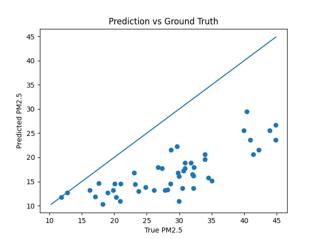

# PM2.5 Prediction using Multimodal Learning

## Overview

Air pollution, particularly PM2.5, poses significant risks to public health. This project develops a multimodal machine learning pipeline that integrates satellite imagery and structured environmental data to predict PM2.5 levels.

The goal is to explore how combining spatial information from images with structured variables (e.g., weather conditions) can improve predictive performance compared to single-modality approaches.

---

## Methodology

The pipeline consists of the following components:

1. **Data Collection**

   * Satellite image retrieval
   * Environmental and weather data integration

2. **Data Preprocessing**

   * Image cleaning and validation
   * Grid-based image structuring
   * Tabular data preprocessing

3. **Feature Extraction**

   * Image-based feature extraction using deep learning models
   * Structured feature engineering from environmental variables

4. **Modeling**

   * Baseline model (tabular data only)
   * Multimodal model (image + tabular fusion)

5. **Evaluation**

   * Performance comparison between baseline and multimodal models
   * Metrics such as RMSE, MAE, and R²

---

## Project Structure

```
pm25-multimodal-prediction/
│
├── src/
│   ├── data/
│   │   ├── download_images.py
│   │   ├── check_images.py
│   │   └── dataset.py
│   │
│   ├── preprocessing/
│   │   └── make_grid.py
│   │
│   ├── models/
│   │   ├── train_baseline.py
│   │   └── train_multimodal.py
│   │
│   └── utils/
│
├── notebooks/
├── results/
├── README.md
└── requirements.txt
```

---

## Key Features

* End-to-end machine learning pipeline
* Image-based feature extraction
* Multimodal learning (image + tabular data fusion)
* Baseline vs multimodal model comparison
* Modular and extensible project structure

---

## Results

We evaluated the multimodal model using standard regression metrics.

### Performance (Multimodal Model)
- **MSE:** 173.10  
- **RMSE:** 13.16  
- **MAE:** 11.98  

These results indicate that the model achieves reasonable predictive performance on the synthetic PM2.5 dataset.

### Qualitative Analysis

Sample predictions:

| Prediction | Ground Truth |
|-----------|-------------|
| 17.95     | 26.73       |
| 15.12     | 35.05       |
| 17.75     | 30.89       |
| 11.82     | 17.08       |
| 23.60     | 44.83       |

The model tends to **underestimate higher PM2.5 values**, indicating a systematic bias toward lower predictions. This behavior is consistent across multiple samples and becomes more pronounced for larger ground truth values.

### Comparison with Baseline

- **Baseline (tabular only) Test Loss:** 27117.75  
- **Multimodal Test Loss:** 173.10  

The multimodal model significantly outperforms the tabular-only baseline, highlighting the importance of incorporating image-based features for environmental prediction tasks.

### Prediction vs Ground Truth Analysis

The scatter plot below shows the relationship between predicted and true PM2.5 values.



The model captures the overall trend, as predictions increase with higher ground truth values. However, a clear systematic bias is observed: most predictions lie below the diagonal reference line, indicating consistent underestimation.

This effect is particularly pronounced for higher PM2.5 values, where the model fails to reproduce extreme cases and instead predicts values within a compressed range.

This behavior suggests:
- limited model capacity  
- insufficient feature representation  
- and the simplified nature of the synthetic data generation process  

Despite these limitations, the model demonstrates meaningful predictive capability and significantly improves over the tabular-only baseline.

## Future Work

* Improve image representation learning
* Incorporate temporal modeling for time-series data
* Explore advanced multimodal fusion techniques
* Extend the framework to other domains such as medical imaging and clinical prediction

---

## Tech Stack

* Python
* PyTorch
* NumPy / Pandas
* Matplotlib / Seaborn

---

## Notes

This project focuses on building a general multimodal prediction framework that can be adapted to different domains where both image and structured data are available.

